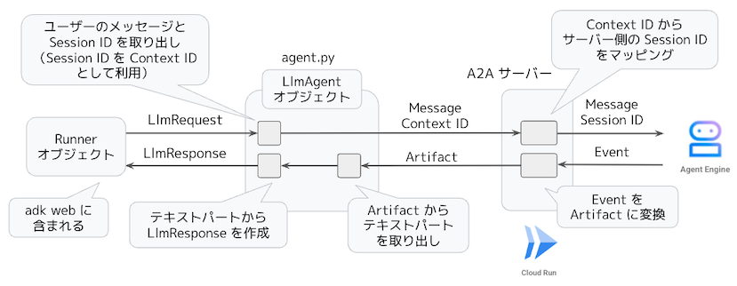
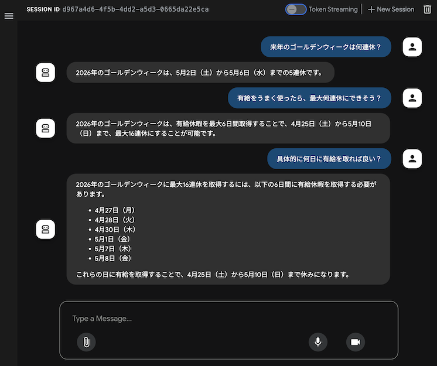

# A2A サーバーを介して動作する Agent Engine 上のエージェントをリモートの ADK から利用する構成例

## アーキテクチャー



### クライアント側

- LlmAgent オブジェクトに設定した `before_model_callback` オプションにより、LlmAgent が受け取った `LlmRequest` をコールバック関数 `a2a_remote_call()` で処理します。（LLM モデルは使用しません。）
- `LlmRequest` に含まれる（最新の）ユーザーメッセージを A2A クライアントを使って A2A サーバーに送信して、受信したテキストメッセージを `LlmResponse` に含めて返します。
- Session ID を A2A の Context ID として送信することで、A2A サーバーに現在のセッションを特定する情報として利用させます。

### サーバー側

- A2A サーバーは、受け取った情報からユーザーのメッセージを取り出して、Agent Engine 上のエージェントに送信します。
- この際、Context ID をサーバー側で管理している Session ID に変換してエージェントに受け渡します。
- A2A サーバーは、Agent Engine 上のエージェントが出力した Event オブジェクトを A2A の Artifact オブジェクトに変換して、A2A クライアントに返送します。

以上により、クライアント側の LlmAgent オブジェクトが A2A サーバー側にあるエージェントのプロキシーとして動作して、クライアント側では、通常の LlmAgent オブジェクトとして利用できます。この時、クライアント側とサーバー側で、セッション情報を独立して持つことになるので、それぞれが保持するセッションの情報が一致しない可能性がある点に注意が必要です。

## セットアップ手順

Cloud Shell で作業します。

- リポジトリをクローンしてデプロイコマンドを実行します。
```
git clone https://github.com/google-cloud-japan/sa-ml-workshop.git
cd sa-ml-workshop/blog/adk_a2a_integration
./deploy.sh
```

- デプロイが完了したら、次のコマンドでチャットアプリを起動します。

```
cd client && source .venv/bin/activate && adk web
```

## 実行例
  



